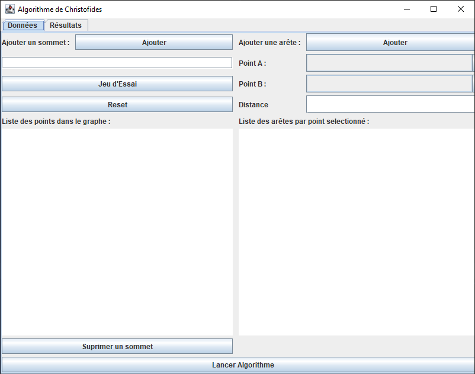
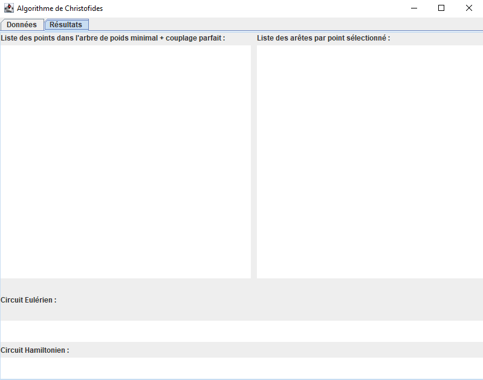

**Présentation du Programme**

_1 - Onglet Données_

Cet onglet permet de saisir toute les données necessaires au calcul :

- **_Ajouter un Sommet :_** Saisir le Nom du Sommet dans le champ puis cliquer sur "Ajouter un Sommet"
- **_Jeu d'essai :_** Charge un jeu d'essai des villes du Grand Est
- **_Reset :_** Réinitialise le Programme
- **_Ajouter une Arête :_** Saisir le point A, le point B et le distance (sans indiqué km) et cliquer le bouton "Ajouter une Arête"
- **_Supprimer un Sommet :_** Supprime le sommet sélectionné et arêtes liées, Sélectionner un point puis cliquer sur "Supprimer un Sommet"
- **_Lancer Algorithme :_** Sélectionner un point dans la liste des points anvant de cliquer sur le bouton "Lancer Algorithme"
- **_Autre fonction:_** cliquer sur un point affichera les arretes liées dans la liste des arêtes

_2 - Onglet Résultats_

Cet onglet permet d'afficher les résultats du calcul :

- **_Liste de gauche :_** S'affiche les points de l'arbe de poids minimal + les points du couplage parfait
- **_liste de droite :_** Affiche les arretes du point sélectionné dans la liste de gauche
- **_Circuit Eulérien :_** Affiche le circuit Eulérien
- **_Circuit Hamiltonien :_** Affiche le circuit Hamiltonien

